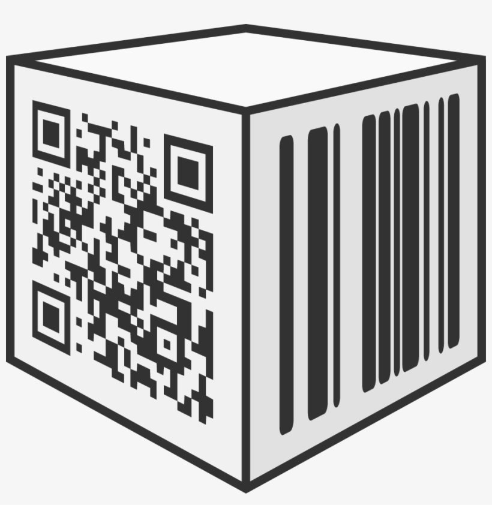

<h2>Barcode Generator</h2>
<div  align="center">
<b>Utility  tool for  Barcode </b></br>
 <a href="https://github.com/avalanche-org/toolbox/tree/main/BCmodule"></a><p>
</div>

### About  

> This tool is designed to generate barcodes. nothing else ! 

### Setup Guide

The use of this module is simple , it works on a container shipped on [dockerhub](https://hub.docker.com/repository/docker/jukoo/bcmodule). 
You can use it as an external service and there are less dependencies.

if you are familiar with docker you can simply run     
```
docker run -d -p<hostPort>:<containerPort> jukoo/bcmodule:tagname  
``` 

That's all !

